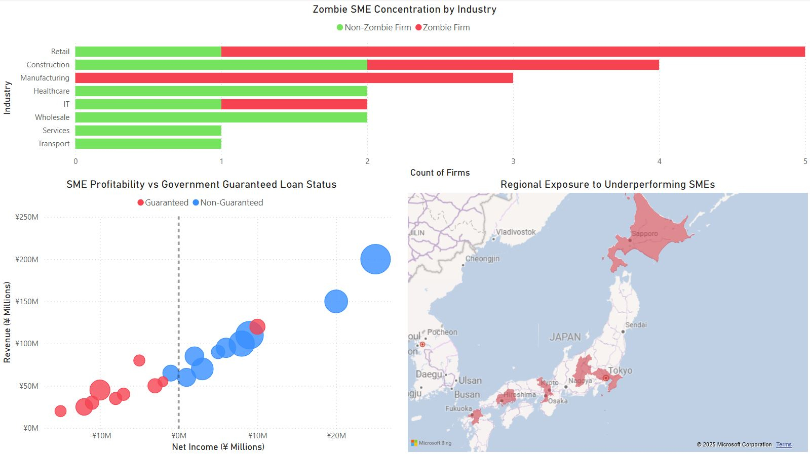
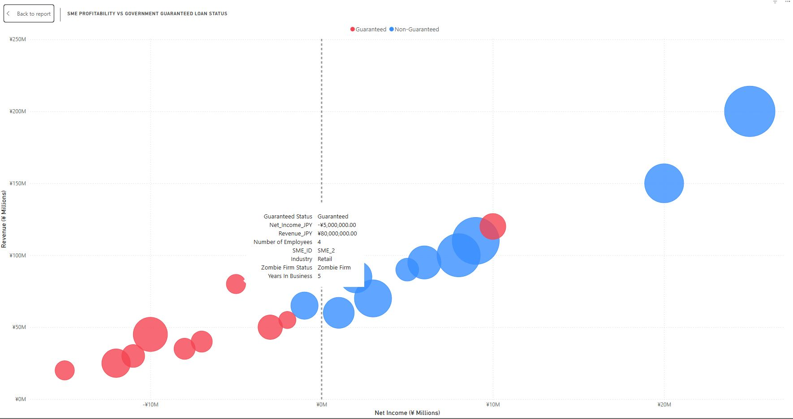

# 📸 SME Risk Tracker – Dashboard Screenshots

This folder contains visual reference material for the SME Risk Tracker prototype.

## 📊 Dashboard Overview

- Highlights zombie SME concentrations by industry and geography.
- Visualizes profit/revenue trends against government guarantee status.

## 🔍 Tooltip Deep Dive

- Demonstrates contextual drilldown capability.
- Each firm reveals SME ID, guarantee status, profitability, industry, employee count, and more.

---

📂 These screenshots are designed for preview purposes on GitHub and external outreach.  
🔧 Built in Power BI using synthetic Japan SME loan data informed by BOJ/FSA reports.
